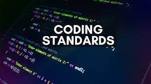

## Do Coding Standards Help Learning a Programming Language

  I believe coding standards do help when it comes to learning a new programming language. Similar to learning any type of language, focusing on the smaller and rather precise details on a new language is extremely important. A strong example of this would be if you were to learn a language like Japanese, you would need to focus on learning the alphabet first, then the grammar, then how to conjunct sentences, and it slowly becomes more complex and more difficult as you continue to learn. Let's take JavaScript for an example, first you need to learn the "alphabet" (like its syntax), then the "grammar" (for and while loops, if-else statments, etc.), then creating and combining "sentences" (projects that utilizes what you've learned), and then you start to create bigger and complex structures whether it be your own website, analyzying data and data structures, or creating an amazing A.I. As such, no matter how trivial and small a standard may be, it's good practice and helps you build a habit for the future. 
  
  Another important factor is once you get the coding standards, you can easily apply it to learning even more programming languages because it is a fundamental in a sense. Once you build your fundamentals, it becomes a perfect foundation for you to utilize and apply what you know to other languages. Take C++ as another example as its syntax is almost as similar to JavaScript/Java and because of this, I was able to pick learning the language pretty quickly due to my prior experience and practice of JavaScript's "coding standards". I understood that formatting the code to make it look clear and consise while still conveying what belongs to where and what does what. I also picked up the habit of adding curly-braces thanks to JavaScript and had no problem finding a missing curly-brace or semicolon in any of my C++ code.

## IntelliJ and ESLint: First Impressions

  After a week of using IntelliJ with the ESLint feature, I believe it is a great IDE. I found it to be more "cleaner" and more visually pleasing then the likes of VSCode or Eclipse. Its user-interface, to me, was way better simply because I liked the colors and fonts they used for the IDE. A huge thing for me that really made me enjoy ESLint was the little feature of pulling your HTML file into the browser directly from the IDE and to me, that is a huge thing for me. I've always hated how I had to keep saving my file and then alt-tab-ing into the file explorer where my HTML file is and continously load the page and refresh it. While, thanks to ESLint, I just click on the Google Chrome icon on IntelliJ and it instantly loads and it also updates the exact same time I save the file. Looking forward to using this IDE more into the future. 
  
  I would like to also add how much easier it's become to push and clone files with GitHub Desktop. I remember keeping GitBash up to just clone the file and keep constanty pushing and pulling origin master to the main branch and man was I so annoyed. Now, it's so much easier and faster so I'm glad they created a Desktop version. 
  
  Whether you acheive a green checkmark or not, I find it to be both useful and a little painful. Everytime I finish creating my code and before running it the console, I see that there isn't a checkmark, I know that I must traverse through my code to see what and where it went wrong. That aspect is incrediby useful for me, but if upon fixing it, there is still no checkmark, it starts to getting a little more annoying. However, its because of how annoying it becomes, that it allows me to better look at my code and get it done sooner.

  Overall, IDE is pretty cool. I might use this as my main IDE for now because of its UI and how accessible our files are. 
