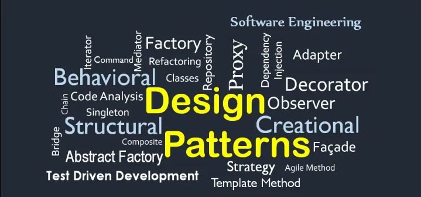

## Designing Patterns?

The idea of designing patterns is plain as simple: DESIGN a PATTERN. That is all there is to it, but what about when it comes to other things that aren't really that physical or on appearance. One strong example is coding. Design patterns in coding start to become much deeper than what the general idea or concept of design patterns are. A bunch of words correlate to this coding thingy-ma-bob and honestly, to me, that's too much. The image on the right and below show on deep design patterns in coding goes. It's like those iceberg memes that focus on certain topics, i.e.: the internet iceberg, etc. However, I do know how incredibly important these designs patterns are in coding. They are templates for the actual code. It's sort of like a blueprint. It is as if a construction worker is looking at an architect's blueprints. However these blueprints aren't necessarily finished, but rather how we approach a problem and solving it through code. It's interesting the types of approaches coders choose depending on the issue they're presented. Fascinating, right?

## Blueprints

Because I'm just a low class construction worker, reading these blueprints are quite confusing. In reality, I would just follow whoever my superior is and follow their orders since they clearly understand what needs to be done. However, just because I'm a low class construction worker doesn't mean I can't be promoted. As I continue my journey becoming a better programmer, I have started to learn the similar patterns that I, myself, and the million other beginner programmers have picked up on when it comes to the numerous issues we face. You sort of start to notice the patterns when it comes to coding like in JavaScript or Python. Some examples of what I have been doing would be like structural patterns when it comes to linking other files to each other. That type of pattern is called bridging, if I am using that pattern correctly. Another good example is building prototypes. I have created prototypes for a few of my codes in the past to ensure everythng is running and finely implemented. It's super cool how you start to pick up on these things and start actually learning from these patterns and improving your own skills as a programmer. I practically promoted myself to a manager or at least a supervisor at this point, I think...

## So is it the Former or the Latter?
I guess the answer to the question would be both "technically", but it is however you look at it (ALL PERSPECTIVE LET'S BE HONEST). Overall, design patterns in coding are cool and kind of interesting the many types of design patterns there are. There are specific patterns for certain programming languages which is super fascinating and really shows how depth and complex design patterns are/can be. It's like you are a manager or supervisor of a construction site telling your fellow workers what to do based off a blueprint the architects gave you. And luckily for me, promotion exists. I can finally start to grasp and understand what the knowledge my once-superiors have. Not only that, but also actually using this knowledge for myself to actual grow my skillset and experience. All of this is starting to sound a bit self-proclaimed, isn't? 
