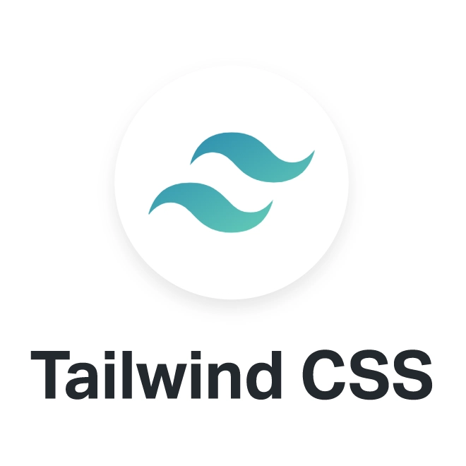
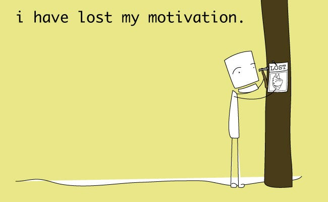

### That Wasn't There Before?

For Spring 2025, I chose to take ICS 414 course as an ICS elective and it was a fun and intersting experience. ICS 414 had the class working with a client to build a website for them. However, the class was split into 5 different groups that will all share the same client, but will build their own website for them. The group I was assigned with were a mix of students who took 314 in the previous spring 2024 semester and those who took the class in Fall 2024 and this lead to a trivial issue though a bit problematic once we figured out what to code with. For context, I took the ICS 314 course in the previous spring semester and that was unfortunately the last time they chose to teach MongoDB, Meteor, and React. One more to add, the newer 314 classes started teaching TypeScript and some of React still (thankfully) and a different backend language though I can't recall which one. IDEs was easily decided, but the languages were the problem. As such, we weren't so sure as to what languages we should code the website with as one-half of the group would end up having to learn the languages/frameworks we choose regardless. In the end we chose to do TypeScript with React and used relating frameworks such as TailwindCSS and Charts.js and a different backend from MongoDB or SQL, that being Vercel, which wouldn't need us to deploy in an online hosting service thanks to the 314 template. Now really began the journey.   

### A Secret Entrance

Thankfully, the languages weren't at all too hard to learn though required a lot of W3Schools (for me). Only way to learn something new is to keep practicing it so this project was very useful in that regard. With the addition of learning the languages came with the cool frameworks that can work with it. I find TailwindCSS and Charts.js to be really cool frameworks to learn and I believe having these two as extra skills will really aid me in the future. Chart.js especially was interesting because you get to work both the front-end and back-end of the website since we are visually showing data that is stored in the back-end. It also was a straightforward framework to use and so was TailwindCSS. TailwindCSS made visualizing the website actually easier and learning that framework was also straightforward enough. Thankfully these framworks came with their documentations so that really assisted me when I ran into a wall. I wouldn't have been able to learn or even know these frameworks if it weren't for my teammates recommending it in which I am very thankful for. TypeScript in itself was somewhat straightforward though I couldn't say I used it as much as I would have wanted to. It really helped that my team chose to also use React as one of the libaries due to having some knowledge/experience with React.

### Spacious Tunnel Though Suffocating
One thing I really enjoyed about the course was the weekly/bi-weekly milestones for the client and for the class. It allowed the entire class to be consistent in working on the project as it gave us deadlines to meet. It encouraged my group to have addtional meetings outside of class to ensure that we stay ontop of these deadlines. Though, admittedly that habit fell so incredibly short for our group. After our first meeting outside of class, we all scheduled to meet again at a planned time once more, but it never came through. The next time we chose to meet outside of class was the night before a milestone and that would basically be the last time we really met together as a group outside of class. A shame although we still managed to pull through and continued to work on the project without it deterring us. 

### Oxygen's Running Low

If there was a thing or two that was a problem with the class throughout the semester, I would say nothing really was problematic at all. The project itself was all up to us and we were given deadlines to meet and deliver. There was also the constant meetings with the class and the client to show each team's progress as the semester went on. There was an incentive to being consistent on the project and what really mattered was the team/members themselves having the motivation/determination to being consistent. In regards to that, my team at the beginning and middle of the semester were incredibly consistent and I would say I was as well. However, as the semester started to come to a close, that is when some of the team (including me) started to fall off in the consistency and that is something I do regret. I started to lose the motivation to keep working on the project and I hated that I did now looking back at it. I wanted to learn more and do more for the project, but I ended up becoming lazier and unfocused. That is the one thing I had a problem with and that would be my laziness and lack of effort. 

### Following the Trail Back
Overall, ICS 414: Software Engineering II was a fun and very insightful learning experience. The ability to actually work with a client and communicate with them to try and achieve a product that they like is sort of a surreal experience for me and not one I would expect in a college course to be honest. It also provided insight to me on how important it is to being consistent with this type of work and how important it is to communicate with your team. To add onto that, having a team that is willing to be consistent is very very nice to have. If these conditions are met, I believe the end product will be amazing. Regrettably, I wanted to do more yet I lacked the effort and determination to do so. Moving forward, I will reflect more on myself and use this class as a stepping stone to bettering my habits and overall being a better worker/teammate. 
