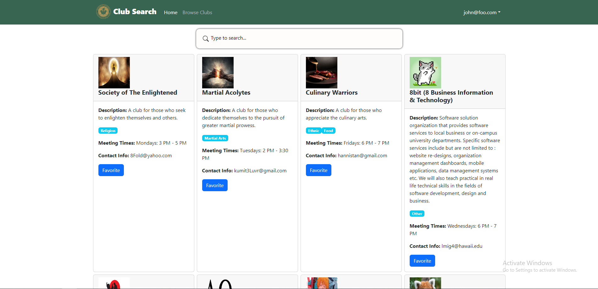
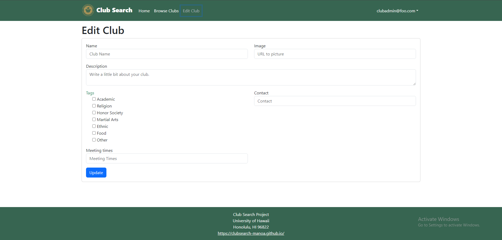
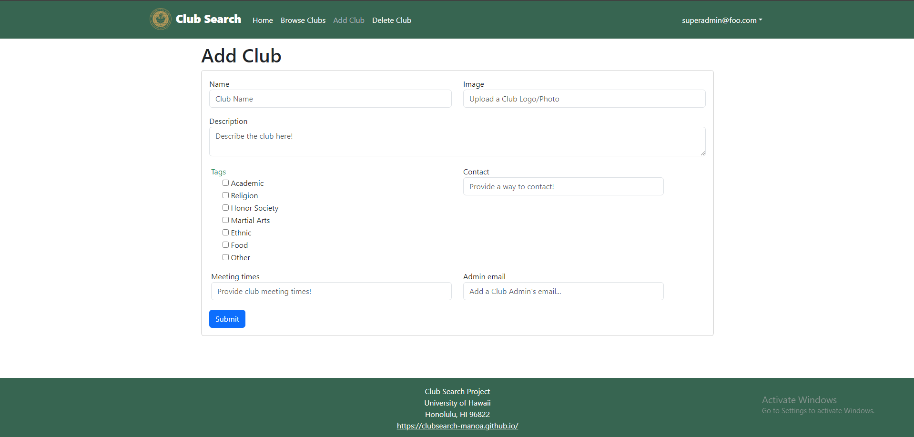

### Overview
  For the software engineering course offered at UH Manoa: ICS 314, I was assigned to a team and a web application idea called Club Hub where it allows students from UH Manoa, the general users, to search and learn more about the clubs offered at UH Manoa. My team and I have also included two other roles that offer different functionalities to the web application: the club admin role and the super admin role. Club admins are for the officers of the clubs they are apart and can access their clubs and edit the information provided for the general users. Super admins are the overseer of all clubs and have the ability to remove and add clubs based off whether the club has been renewed, removed, or freshly started. It is a simple yet incredibly useful web application for students who want to join or explore the clubs offered at UH Manoa and for UH Manoa faculty to access regarding the clubs. 

### Experience
  The time frame we were given for this project was roughly about a month or so, and despite that massive time frame we were allotted, we still had deadlines to meet to ensure we are on track to complete the project. These deadlines would turn out to be incredibly stress-inducing for us because they were also graded and so we needed to make sure that we were not procrastinating and we had set time aside for each individual's schedule to meet up and starting building the web page. Meeting those deadlines weren't exactly fun however the team bonding and progression of our project went quite smoothly throughout. Regardless, it helped build my communication skills and also helped improved the way to cooperate in a team in this type of project. It was a very fun and very informative experience. 

  Some of the functionality we implemented was the actual search bar function for the clubs, an edit club page for the club admins to freely edit the clubs they are assigned to, and an add page where the super admins can add newly created clubs or renewed clubs. 

  For the month, we had three milestones which were basically our deadlines and each team member for each milestone had to be assigned to and complete two issues, which were basically our tasks we needed to complete by that milestone's deadline. A few issues I enjoyed doing were for when I was in charge of creating the actual search bar function and creating a loading screen into the website. I learned how to create an active search bar where as the user types any input, it actively changes the search results. I also chose to learn it in React because it was a framework we were using for the course and that made implementing this function much easier. However, the loading screen on the other hand was not so much of an important learning experience for the course, but rather a personal experience in learning how to animate SVG files through CSS. Although, it was also done with the assistance of ReactJS! 

  Overall, it was a fun process. I believe I have grown as a coder throughout this project and definitely have improved my skill set. 

  A huge thank you to my team. They were the best and super cooperative! 

### Coding Languages/Tools
  The programming languages, frameworks, libraries, and databases we implemented were of the following: HTML, CSS, JavaScript, Meteor, ReactJS, and MongoDB. We also utilized TestCafes to ensure our application's functionality was properly working for any user or admin. 

  Here is our documentation:
  - [ClubSearch-Manoa Home Page](https://clubsearch-manoa.github.io/)

  Here is our actual page so feel free to create an account and explore!
  - [ClubSearch-Manoa](https://clubsearch-manoa.xyz/)

