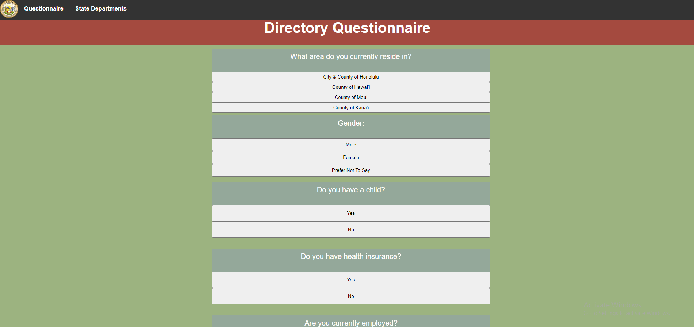
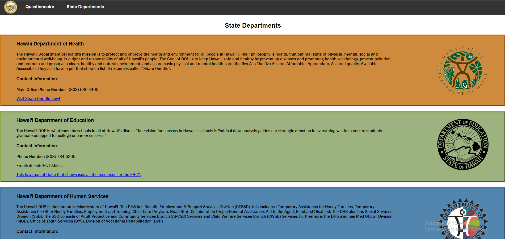

Back in 2020 when COVID-19 just hit, my computer science class for high school had to participate in the Hawaii Annual Code Challenge. We made a group of four at random and were tasked to think of an idea, pitch said idea, and then create the idea. Afterwards, we would have to present to a selection of judges for the challenge. From the beginning all the way to the end, the process took over a month or so. It was definitely an experience as a sophomore in high school. It was both exciting and stressful although it was a major learning experience for almost everyone in my class. 

### The Project
The idea my group and I pitched in for the HACC was to create a type of app that could aid the user in need of elderly/children assistance/care. My group and I had a team name which was called HyperText and we unfortunately didn't create a name for the app or rather a clever one. The website upon using it reads, "Family Resource Directory", and that would be the most befitting name for the app/website. The app itself is a questionaire that gathers the user's input through a series of questions and based off the questions, we refer to the users to departments located in Hawaii and provide their information. 

        

### Coding Languages
We heavily used HTML and CSS and used some JavaScript. On the github, it roughly says about 0.7% was used (lol). 

Here is the link to our <a href="https://github.com/HACC2020/HyperText">GitHub.</a>

Here is the link to the actual <a href="https://hacc2020.github.io/HyperText/index.html">app.</a>
