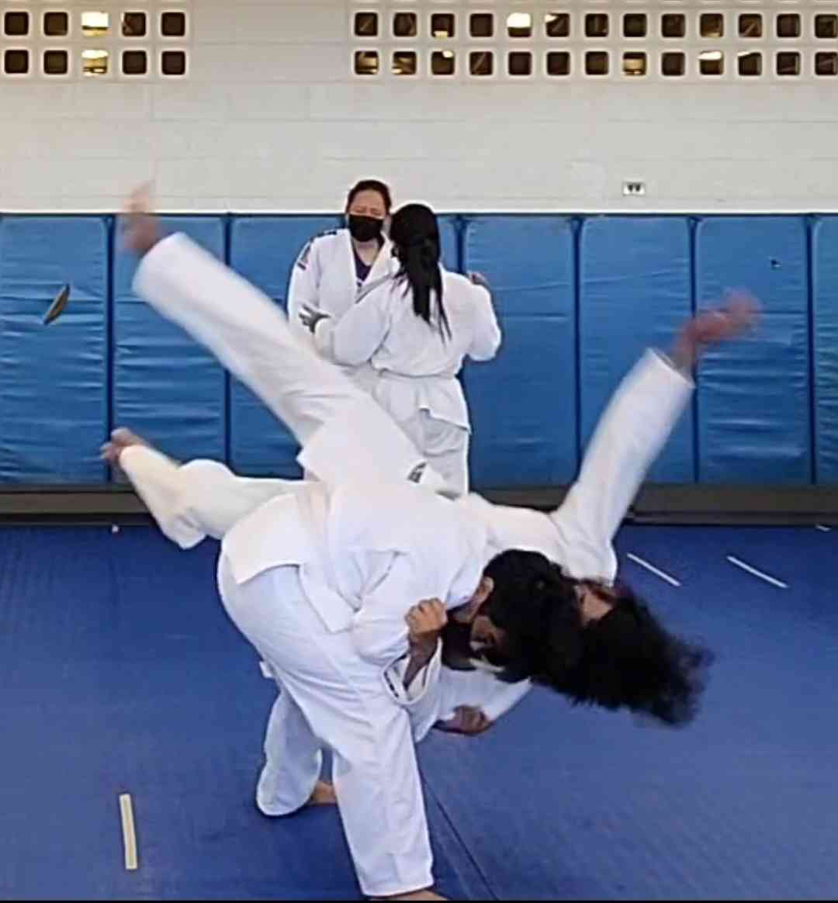
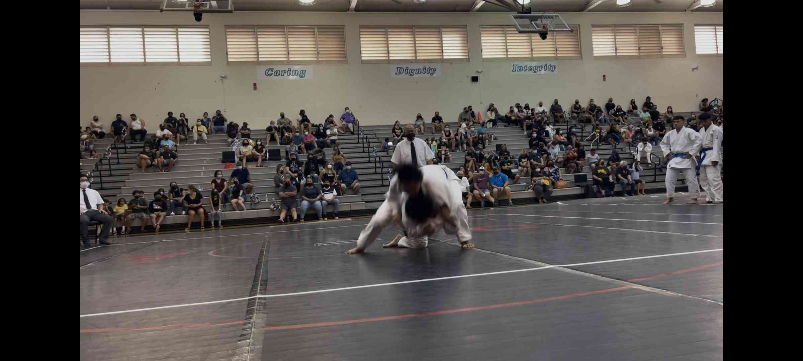

 practicing ippon seoi-nage (my favorite throw)

I first started judo around my sophomore year of high school as just a team member and have fallen in love with the martial art. After my graduation, I became a coach for the team and whenever I have the time, I come by and help. I am still a blue-belt and I am striving for a higher belt. I constantly try to improve so when I am ready for a belt promotion, I can proudly say that I have fairly earned it. It honestly was the first real activity/experience that taught me true discpline and patience. It has also taught me that through hard-work and perseverance, you can reap what you've sowed. It really turned my life around for the better despite the injuries that came after. 

Me as a person also grew, both in terms of mindset and personality. Before judo, I was quite an introvert (I sort of stil am), but now I became more open-minded, a bit more energetic, and just a percent more outgoing. I also developed the mindset of moving forward one step at a time and when things fall onto your path, then jump, punch, kick, or do whatever in your power to get it out of your way. Prior, I always thought that sometimes maybe it is what it is, but its different now. It's better to be more positive rather than to be complacent.

2023 was definitely a rough year, but hopefully 2024 I can continue to pursue it more!

This was in my senior year and I was allowed to play for my team after a knee injury:
 

